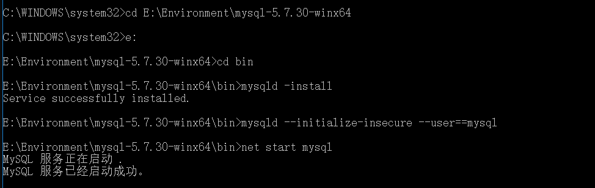

# <p align='center'>华园猫崽 </p>
<p align='center'>SCUT Cat</p>


一款社交、工具类，针对猫咪爱好者的微信小程序（华南理工大学校园版）

<div align='center'>

[]()
[](https://spring.io/projects/spring-boot)
[](https://dev.mysql.com/get/Downloads/MySQL-5.7/mysql-5.7.19-winx64.zip)
[]()
[]()

</div>

---

## 1.系统说明

本系统为微信小程序的后端程序

## 2. 系统配置

mysql: port:3306 username:root password:123456

server(https) port:443 

## 3.前端常见测试错误总结

500：服务器内部问题，原因可能是：

    1.可能后端没写好(mapping文件有错)

    2.插入值不符合要求（如：id重复了）

400：url没写对，找不对对应的方法

405：get或者post等一些方法没有被后端允许（不过目前所有方法都被允许了）

请求不了：没带端口号或者端口号（默认端口号443）

## 4.功能：

### 4.1 基本功能：
- [ ] 注册或登录

- [x] 发帖（文字）/删帖 / 更新帖子
  
- [ ] 发帖（图片）
  
- [x] 关注/取消关注帖子

- [x] 获取关注的帖子

- [x] 评论/删除评论

- [x] 获取评论

- [x] 评论的排序：按赞数，按时间

- [x] 点赞/取消点赞 帖子/评论

- [x] 转发(仅记录转发数量)
  
- [x] 用户的类型(官方，认证机构或商家，普通用户）
  
- [x] 获取用户关注/粉丝
  
- [x] 关注/取消关注用户
  
- [x] 帖子的搜索功能
  
- [x] 帖子标签与分类(通过帖子搜索功能实现)
  
- [x] 热度实现(定时器任务)
  
- [ ] 主界面帖子的推荐
  
- [x] 帖子的排序(按时间)(按点赞数)

- [x] 帖子的排序(按热度)

- [ ] 帖子推荐的个性化

- [x] 科普部分(添加，删除，获取)

- [x] 科普帖子的搜索(全匹配与分词匹配)

- [x] 用户的浏览历史

- [ ] 用户的偏好（用于推送求助和活动信息）

### 4.2 考虑功能：

- [ ] 分类/搜索后对结果排序功能的组合实现

- [ ] 发帖支持视频上传
  
- [ ] 求助信息的通知

- [ ] 帖子搜索：输入关键字化，错别字替代

### 4.3 社会版功能
- [ ] 小组分类（不同类型的宠物） 
 
-交易板块：

- [ ] 众筹
  
- [ ] 交易支付
  
- [ ] 商品上架

## 5.issue
 
### 5.1 帖子

- [ ] 大量的帖子一次性返回与选择数量返回:getFollow,getUserAll,...

- [ ] 待测试：每小时自动更新post hot（热度）

### 5.2 mysql mybatis

- [ ] 待测试：group by / order by 等SQL语句

## 附录

#### MySql 安装
1. 点击文档开头的MySQL图标安装，（注意需为win64）
2. 安装解压后，在文件加中加入.ini文件，配置好相应的路径（注意最后还需要/)
3. 以**管理员**的身份运行cmd，并进入相应的目录下运行下图命令

4. 启动成功！`net stop mysql`关闭服务器，`mysql -u root -p`进入MySQL（需要配置环境变量），`exit`退出
5. 修改密码: 以密码为123456为例
   ```bash
   update mysql.user set authentication_string=password('123456') where user='root'and Host = 'localhost';
    ```